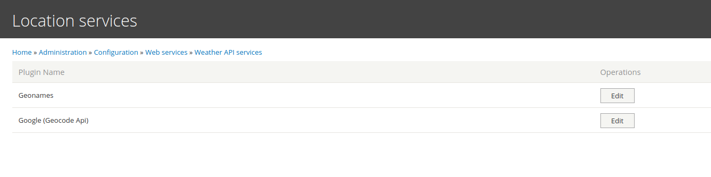
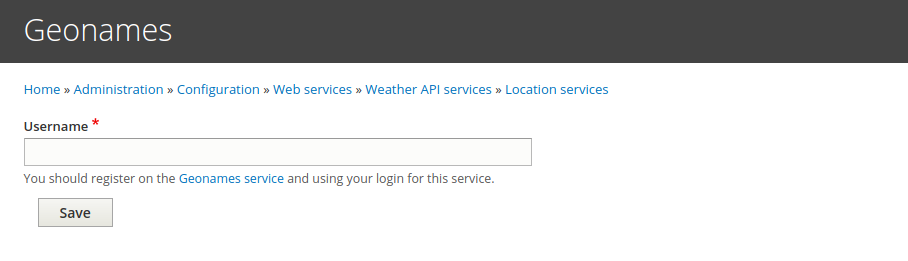
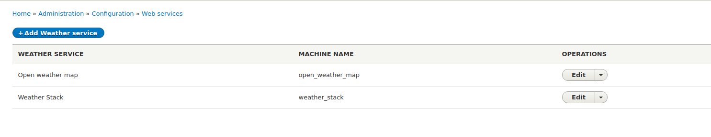
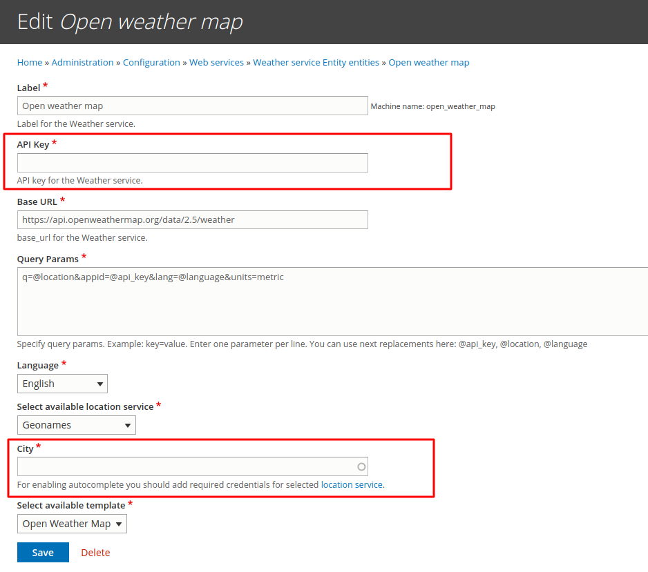
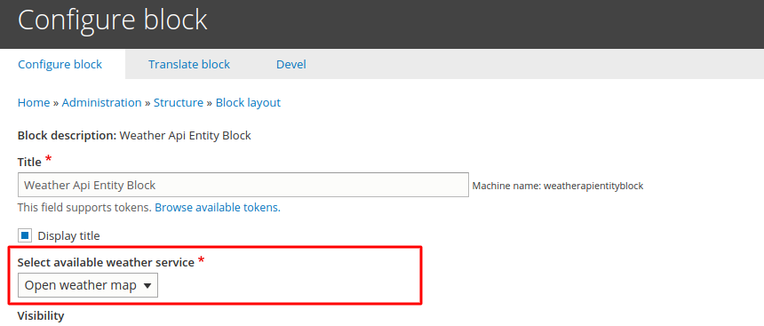
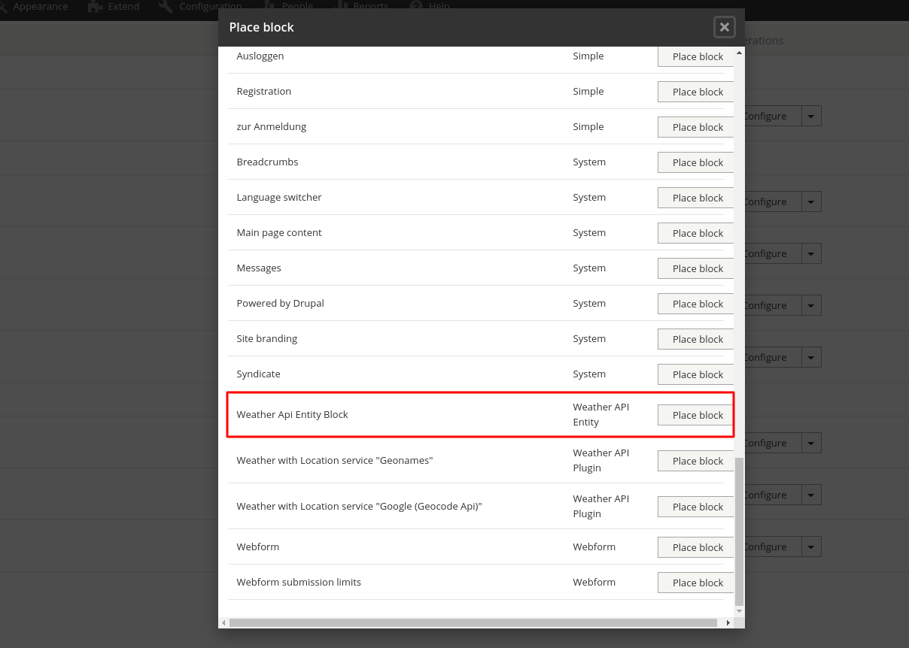
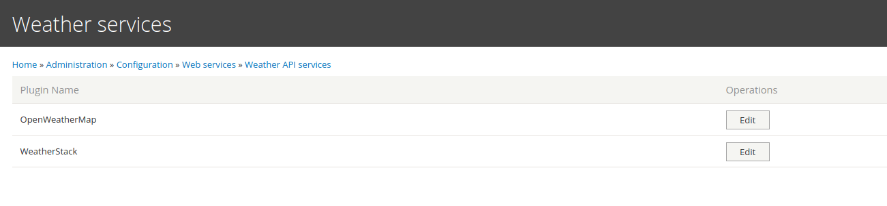
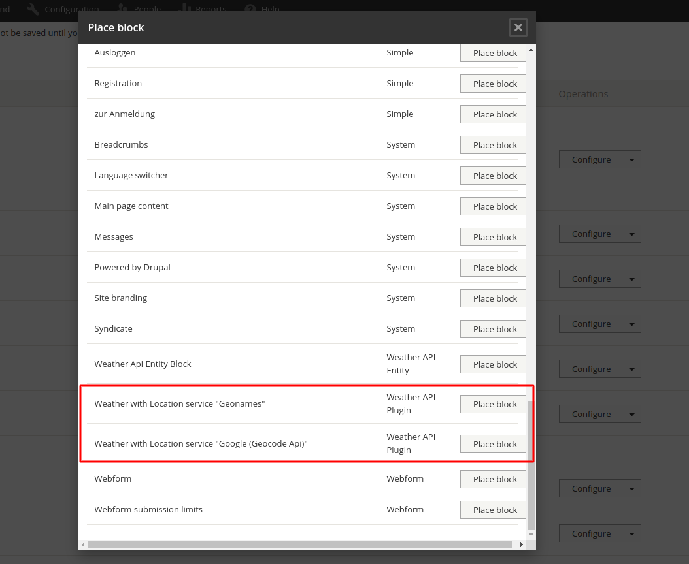
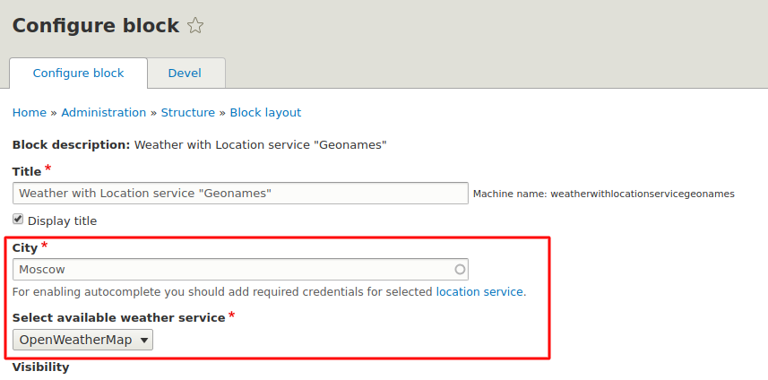

#Flexible weather API

This module includes two structure of plugins, the first plugin is location
service, the second one - weather service.
The main module contains service for sending requests and location service
plugin. With location service plugin you can
easily integrate any service which can help you select the required location.
This plugin is used as the autocomplete
address field on the weather block configuration form.

On the page `admin/config/services/weather-api/location-services` you can find
the list of default available location
service plugins.

For each plugin there is its own configuration form with settings that current
plugin is requiring. For using
autocomplete you have to fill all required settings. For example location
service Geonames requires the name of the
user who registered in the Geonames service.

After adding required settings autocomplete will available.

In addition to the main module, there are also 2 submodules. Each of them
provides two weather services by default.
Each submodule contains its own block which will be rendered the weather data.
You can find all the admin pages in the
Administration menu.

##Submodule weather_api_entity
It includes a configuration entity that contains information about weather
service from which will request the data of
the weather for selected locations. After enabling this module you can find all
 default available weather services on
the page `admin/config/services/weather_service_entity`

For make default services work you have to add required settings: API key and
location

Also for each weather service there is a twig template where you can adjust
displaying information about the weather.
The list of available templates is set in the function and can be altered via
`hook_weather_api_entity_available_templates_alter` for adding your own
templates.
You also can add your own weather service entity, set required parameters,
and create a template. After that, your
weather service will available on the block configuration form

This submodule provides an easy way of adding new weather services to the site.
The block which provides this module

##Submodule weather_api_plugin
It includes a more flexible way of adding weather services on the site using
the structure of the plugins. After
creating a new plugin it will be integrated automatically to the site and for
them will be added configuration form
with required settings. On the page
`admin/config/services/weather-api/weather-services` you can find the list of
default
plugins

Those plugins are requiring creating the twig templates which you have to add
to the annotation of the plugin. The list
of blocks which provided this module -

If you will add your own plugin with location service, for this new plugin will
automatically create a new block type.
This block contains an autocomplete field and field with weather service.

